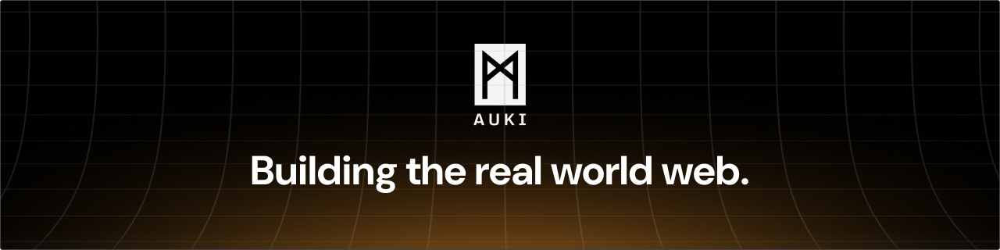
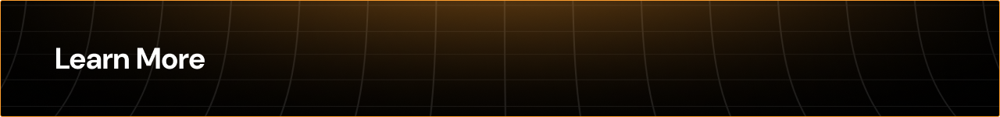
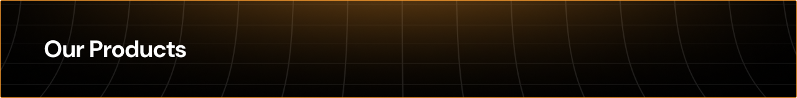
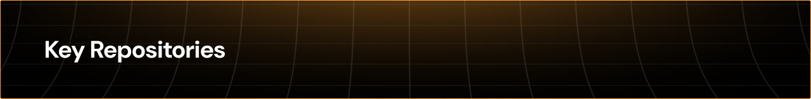
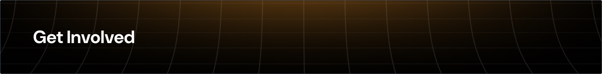

  
  &nbsp;
  
  &nbsp;
  
  &nbsp;
  

 

  <strong>Auki Labs</strong> develops the <a href="https://github.com/aukilabs/posemesh">real world web</a> to make the physical world browsable, searchable and navigable for robots and AI.

  It is a universal and collaboratively editable spatial context layer, giving robots and other devices the means to build and maintain a shared understanding of the environment — enabling multi-robot coordination, better HRI and more immersive XR experiences.

  Based on the open source <strong>posemesh protocol</strong>, the real world web is a decentralized spatial computing network dividing the physical world into <em>"domains"</em> — shared canonical coordinate systems, spatio-semantic representations and hyperlocal compute resources to help navigate and understand the environment.

<h3 align="center">Extending the Internet in Three New Dimensions</h3>

<table width="100%">
  <tr>
     
    <td align="center" width="33%">
       
      
<strong>The Internet of Spaces</strong>

      
Browse, search and navigate the physical domain  

      
    </td>
       
    <td align="center" width="33%">
       
      
<strong>The Internet of Sensors</strong>

      
Access additional sensor data relevant to the domain  

      
    </td>
       
    <td align="center" width="33%">
       
      
<strong>The Internet of Actuators</strong>

      
Give AI agents access to embodiment in the domain  

      
    </td>
  </tr>
</table>

<em>The posemesh is the decentralized nervous system of AI.</em>

 

<table width="100%">
  <tr>
    <td align="center" width="33%">
       
      
        
      <strong>Whitepaper</strong>
       
      Our vision of the future
        
      
    </td>
    <td align="center" width="33%">
       
      
        
      <strong>Strategy</strong>
       
      A simple recipe for winning robotics
        
      
    </td>
    <td align="center" width="33%">
       
      
        
      <strong>Keynote</strong>
       
      Watch our keynote at SuperAI 2025
        
      
    </td>
  </tr>
</table>

 

To showcase what can be done on the real world web, Auki Labs develops, maintains, and commercializes a growing number of reference products.

<table width="100%">
  <tr>
    <td width="25%">
       
      
<strong>Cactus</strong>

      
Spatial AI platform for retail operations — staff navigation, task tracking, and AR overlays  

      
    </td>
    <td width="25%">
       
      
<strong>Gotu</strong>

      
Indoor navigation for events and property management  

      
    </td>
    <td width="25%">
       
      
<strong>McKenna</strong>

      
Spatial decoration for homes and exhibitions  

      
    </td>
    <td width="25%">
       
      
<strong>Floorcraft</strong>

      
Local multiplayer shared AR experiences  

      
    </td>
  </tr>
</table>

 

| Repository                                                                     | Description                                                      |
| ------------------------------------------------------------------------------ | ---------------------------------------------------------------- |
| **[posemesh](https://github.com/aukilabs/posemesh)**                           | Master resource for the open-source posemesh project (Rust, MIT) |
| **[reconstruction-server](https://github.com/aukilabs/reconstruction-server)** | Posemesh node for 3D reconstruction of physical spaces           |
| **[domain-viewer](https://github.com/aukilabs/domain-viewer)**                 | Visualize posemesh domains in the browser                        |
| **[pathfinding](https://github.com/aukilabs/pathfinding)**                     | Hybrid graph + navmesh pathfinding for navigation and robotics   |
| **[auki_robotics](https://github.com/aukilabs/auki_robotics)**                 | Resources for integrating robots                                 |
| **[sparkjs](https://github.com/aukilabs/sparkjs)**                             | Rendering optimizations for Gaussian splats                      |

 

<table width="100%">
  <tr>
    <td>
       
      
<strong>Developer Grants</strong>

      

        Grants of up to <strong>$100,000 USD</strong> in $AUKI tokens are available for builders who create compelling spatial applications on top of the posemesh.
      

      
        
      
    </td>
    <td>
       
      
<strong>Contribute</strong>

      

        The posemesh is open source and we welcome contributions. Issues tagged <a href="https://github.com/aukilabs/posemesh/issues?q=is%3Aissue+is%3Aopen+label%3A%22good+first+issue%22"><code>good first issue</code></a> are a great place to start.
      

      
        
      
    </td>
  </tr>
</table>

 

Founded in 2019 and headquartered in Hong Kong, Auki Labs is backed by **Outlier Ventures**, **Animoca Brands**, **Tribe Capital**, and 20+ other investors.

> _Our mission is to increase civilization's intercognitive capacity: our ability to think, experience and solve problems together with each other and AI._

We are a team that believes in radical sincerity, thinking out loud, and training for the Olympics — a shorthand for bringing extraordinary discipline to an ambitious vision.

Proud members of [Intercognitive.com](https://www.intercognitive.com)

 

  
  &nbsp;
  
  &nbsp;
  

