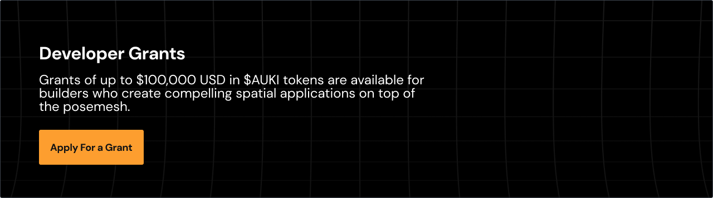
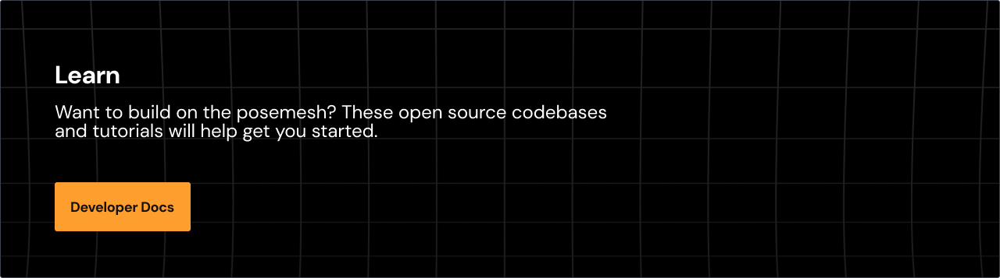

  
  &nbsp;
  
  &nbsp;
  
  &nbsp;
  
  &nbsp;
  

 

  <strong>Auki Labs</strong> develops the <a href="https://github.com/aukilabs/posemesh">real world web</a> to make the physical world browsable, searchable and navigable for robots and AI.

  It is a universal and collaboratively editable spatial context layer, giving robots and other devices the means to build and maintain a shared understanding of the environment — enabling multi-robot coordination, better HRI and more immersive XR experiences.

  Based on the open source <strong>posemesh protocol</strong>, the real world web is a decentralized spatial computing network dividing the physical world into <em>"domains"</em> — shared canonical coordinate systems, spatio-semantic representations and hyperlocal compute resources to help navigate and understand the environment.

<h3 align="center">Extending the Internet in Three New Dimensions</h3>

<table width="100%">
  <tr>
    <td align="center" width="33%">
       
      
<strong>The Internet of Spaces</strong>

      
Browse, search and navigate the physical domain

       
    </td>
    <td align="center" width="33%">
       
      
<strong>The Internet of Sensors</strong>

      
Access additional sensor data relevant to the domain

       
    </td>
    <td align="center" width="33%">
       
      
<strong>The Internet of Actuators</strong>

      
Give AI agents access to embodiment in the domain

       
    </td>
  </tr>
</table>

<em>The posemesh is the decentralized nervous system of AI.</em>

 

<table width="100%">
  <tr>
    <td align="center" width="33%">
       
      
        
      <strong>Whitepaper</strong>
       
      Our vision of the future
        
      
    </td>
    <td align="center" width="33%">
       
      
        
      <strong>Strategy</strong>
       
      A simple recipe for winning robotics
        
      
    </td>
    <td align="center" width="33%">
       
      
        
      <strong>Keynote</strong>
       
      Watch our keynote at SuperAI 2025
        
      
    </td>
  </tr>
</table>

 

To showcase what can be done on the real world web, Auki Labs develops, maintains, and commercializes a growing number of reference products.

- **[Cactus](https://www.getcactus.ai/)** — Spatial AI platform for retail operations — staff navigation, task tracking, and AR overlays
- **[Gotu](https://www.auki.com/solutions/software/gotu)** — Indoor navigation for events and property management
- **[McKenna](https://www.auki.com/solutions/software/mckenna)** — Spatial decoration for homes and exhibitions
- **[Floorcraft](https://www.auki.com/solutions/software/floorcraft)** — Local multiplayer shared AR experiences

 

- **[posemesh](https://github.com/aukilabs/posemesh)** — Master resource for the open-source posemesh project (Rust, MIT)
- **[reconstruction-server](https://github.com/aukilabs/reconstruction-server)** — Posemesh node for 3D reconstruction of physical spaces
- **[domain-viewer](https://github.com/aukilabs/domain-viewer)** — Visualize posemesh domains in the browser
- **[pathfinding](https://github.com/aukilabs/pathfinding)** — Hybrid graph + navmesh pathfinding for navigation and robotics
- **[auki_robotics](https://github.com/aukilabs/auki_robotics)** — Resources for integrating robots
- **[sparkjs](https://github.com/aukilabs/sparkjs)** — Rendering optimizations for Gaussian splats

 

 

 

 

Founded in 2019 and headquartered in Hong Kong, Auki Labs is backed by **Outlier Ventures**, **Animoca Brands**, **Tribe Capital**, and 20+ other investors.

> _Our mission is to increase civilization's intercognitive capacity: our ability to think, experience and solve problems together with each other and AI._

We are a team that believes in radical sincerity, thinking out loud, and training for the Olympics — a shorthand for bringing extraordinary discipline to an ambitious vision.

Proud members of [Intercognitive.com](https://www.intercognitive.com)

 

  
  &nbsp;
  
  &nbsp;
  
  &nbsp;
  
  &nbsp;
  

